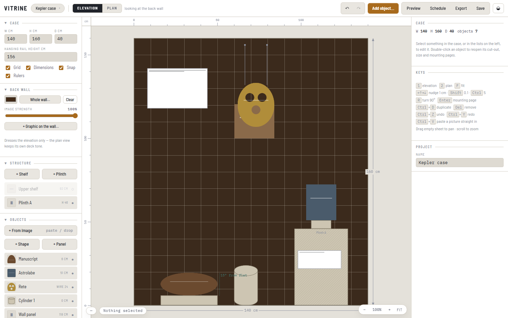
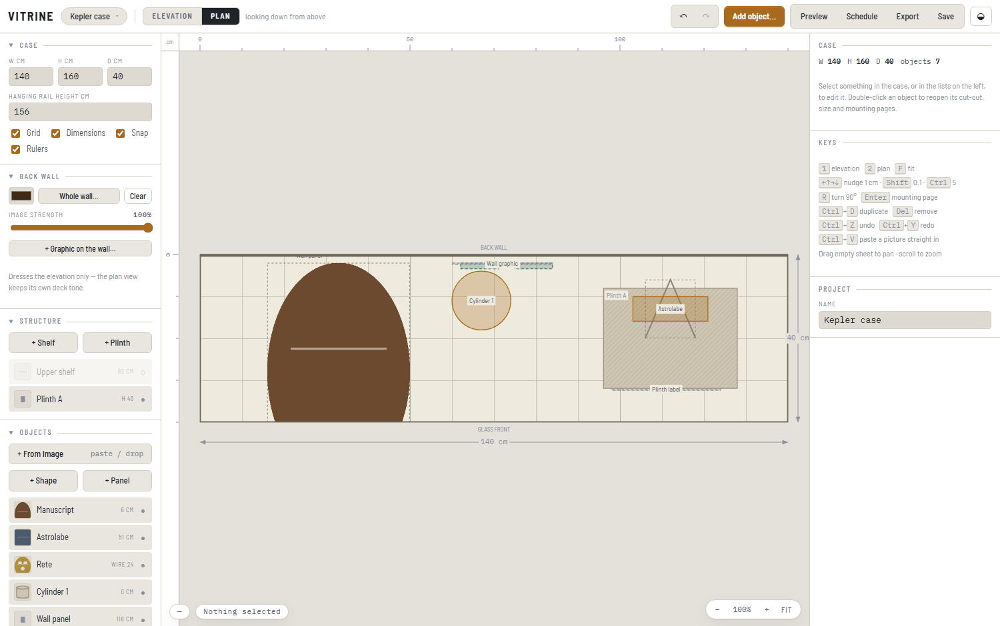
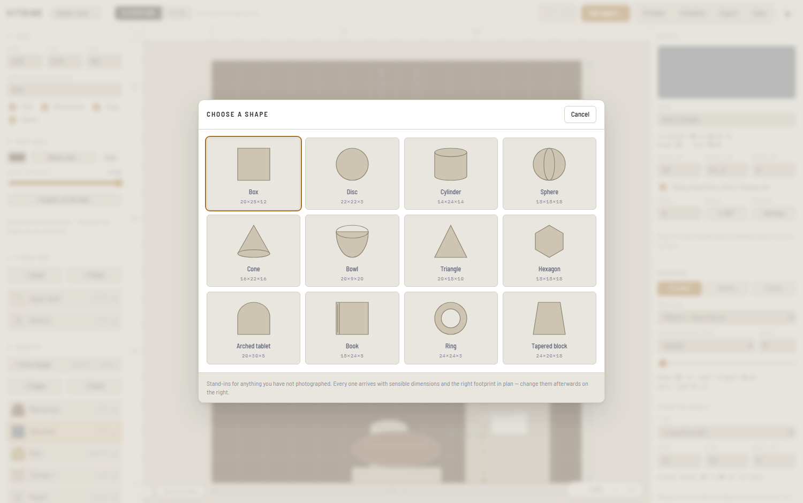
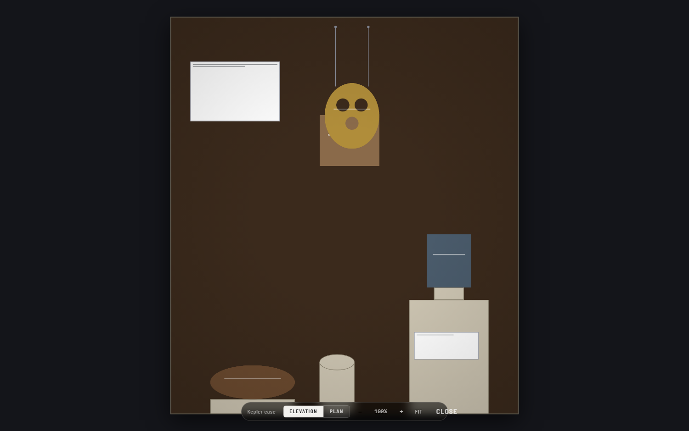
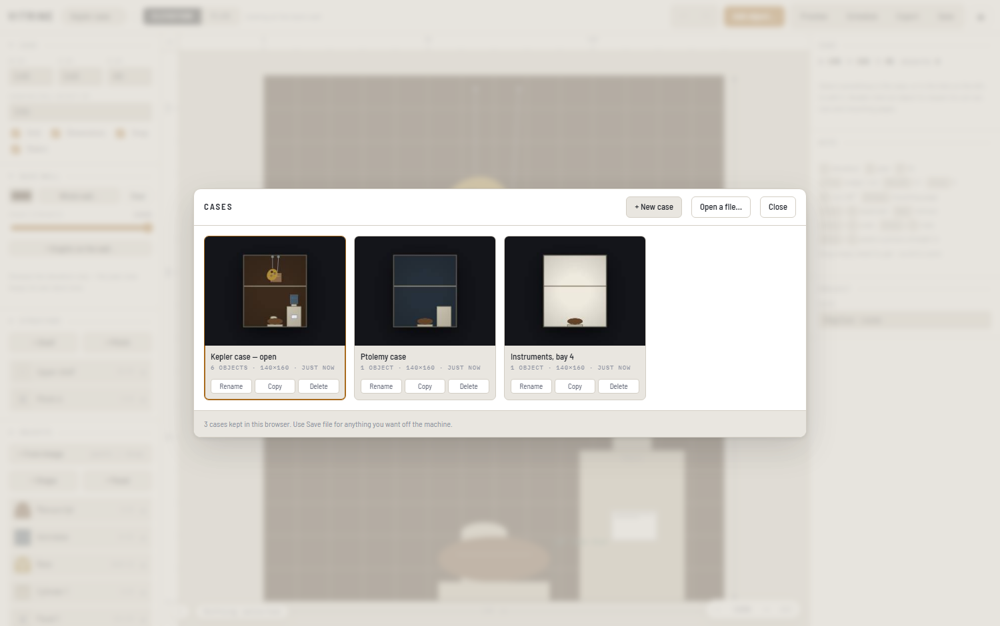

# Vitrine

Schematic layout for museum display cases. You give it the case dimensions, drop in
photographs of the objects, tell it how big each one really is, and it draws the case
to scale in both **elevation** (looking at the back wall) and **plan** (looking down).

Everything is in centimetres. Everything runs in the browser — one HTML file, no
install, no server, no account, and nothing leaves your machine.

## Why

Exhibition design tools are 3D and want a model or a collections-management record
before you can place anything. Gallery-wall planners are 2D but only handle framed
pictures on a flat wall. Neither helps much with the thing a curator actually does
early on: work out whether four objects, a plinth and a cradle will physically fit
in a 140 × 160 cm case, and at what heights.

Vitrine sits in that gap. Its front door is a photograph, its output is a scale
drawing and an install schedule, and it is deliberately not 3D.

## What it does

**Objects come from photographs.** Drop, paste or pick an image and a three-step
panel opens: cut the background out, say how big it really is, say how it is mounted.
Background removal is a flood fill in plain JavaScript — no model download — with a
wand, erase and restore brushes, a crop tool and zoom for fine work. Two passes are
offered: *from edges* for solid objects, and *everywhere*, which keys a colour out of
the whole picture and is what openwork like an astrolabe rete needs.

**Scale comes from one measurement.** Type the real width or the real height and the
other follows from the picture. Or drag a line across something you know the length
of and give that. Depth you type, because a flat photograph cannot tell you.

**Mounting is modelled properly.**

| Mount | What it means |
| --- | --- |
| Placed | Rests on the case floor, a shelf or a plinth. Optional stand or book cradle. Can lean back. |
| On wires | Hangs from a rail at a given height. One wire hangs it straight; two wires of different lengths tilt it. |
| Fixed | Stuck flat to a vertical surface — the back wall, or the front face of any plinth. |

**Stands and cradles belong to the object.** A V stand, a plain block or a book cradle
is always centred underneath and travels with it. A V stand only splays seen from
*above*, where it points to the back and opens towards the glass — from the front you
get its base and its notches. A book cradle is cut to fit its book, so it takes the
object's own width and depth and you give only the height.
Whatever the stand, its own footprint is what has to fit on the plinth, and the overhang
warnings use it.

**Lean can be measured from upright or from flat.** For a manuscript in a cradle,
"15° from flat" is the natural way to say it. The elevation shows the foreshortened
height, the plan shows the deck it actually covers, and once something leans past
halfway to flat the plan draws the picture itself rather than a rectangle.

**Everything is depth-sorted.** Objects, plinths and shelves are drawn back to front in
one pass, so what is nearer the glass covers what is behind it. Anything fixed to the
back wall sits behind everything else outright — a graphic on the wall cannot get in
front of an object in the case, whatever its stand-off.

**Things line themselves up.** Drag anything and it looks for a line to settle on — the
centre or either edge of any other item, or of the case — and shows you which one it
found. Centre-to-centre wins ties, because that is the one people mean. The tolerance is
in screen pixels, so zooming in gives finer control automatically.

**Plinths have a face.** A colour, a picture, or a graphic cut out and fixed to the
front, exactly as the back wall works.

**It tells you when things do not fit** — past the case sides, above the top, deeper
than the case, overhanging whatever it stands on, or wider than the plinth face it is
stuck to.

**It produces an install schedule** — every object's size, base height, top height,
distance from the left and back, lean and wire lengths, copyable straight into a
spreadsheet.

**Stand-in shapes for anything not yet photographed.** A picker of twelve — box, disc,
cylinder, sphere, cone, bowl, triangle, hexagon, arched tablet, book, ring, tapered
block — each arriving at a sensible size and with the right footprint in plan, so a
cylinder reads as a circle from above without being told.

**Interpretation panels carry real type.** Text size is set in centimetres and shown in
points, so the panel tells you whether that wording actually fits at 16 pt on a
30 × 20 cm board before anyone sets it. Paste wording straight in from a label document;
line breaks are kept. Select a plinth before adding one and it goes on that plinth's
front face, sized to fit.

**Preview mode** goes full screen and strips every drafting mark — grid, rulers,
dimensions, labels, handles — leaving the case as it would be seen, lit against a dark
surround. Zoom and pan still work; nothing can be moved by accident.

**Undo** covers everything, sixty steps deep: <kbd>Ctrl</kbd>+<kbd>Z</kbd>, or the
arrows in the toolbar.

**Cases are kept as a library.** Work on as many as you like and switch between them
from a picker of thumbnails. **New case** starts a fresh one without losing the last —
everything is filed as you go, so there is nothing to remember to save.

Also: shelves and plinths, a back wall colour or image, graphics fixed to the wall, a
plan-level filter, a turn handle for rotating objects, toggles for grid, dimensions and
rulers, PNG export of either view, light and dark, and save/open to a `.vitrine.json`
file that carries the cut-outs with it.

## Running it

Open `index.html` in Chrome. That is the whole thing — no install, no server, no build
step, nothing to sign into. Download the file on its own and it still works.

Your cases are saved by the browser, not written into the file, so replacing
`index.html` with a newer build keeps everything you were working on. Chrome treats all
local files as one place, which is why a fresh copy of the file finds your cases.

That also means they live in *that browser on that machine*. **Save file** writes a
`.vitrine.json` you can keep, move between machines, or send to someone — the only copy
that survives a cleared browser.

### Keys

| | |
| --- | --- |
| <kbd>1</kbd> / <kbd>2</kbd> | elevation / plan |
| <kbd>F</kbd> | fit to window |
| <kbd>P</kbd> | preview mode (<kbd>Esc</kbd> to leave) |
| <kbd>Ctrl</kbd>+<kbd>Z</kbd> / <kbd>Ctrl</kbd>+<kbd>Y</kbd> | undo / redo |
| <kbd>←</kbd><kbd>→</kbd> | nudge 1 cm — <kbd>Shift</kbd> 0.1 cm, <kbd>Ctrl</kbd> 5 cm |
| <kbd>↑</kbd><kbd>↓</kbd> | step between surfaces, or change wire length |
| <kbd>R</kbd> | turn 90° |
| <kbd>Enter</kbd> | reopen the mounting page |
| <kbd>Ctrl</kbd>+<kbd>D</kbd> / <kbd>Del</kbd> | duplicate / remove |
| <kbd>Ctrl</kbd>+<kbd>V</kbd> | paste a picture, or text into a selected panel |
| double-click | reopen an object's cut-out, size and mounting pages |

## Known limits

- **No TIFF.** Chrome has no TIFF decoder. Vitrine detects them and says so rather
  than failing silently — convert to PNG or JPEG first.
- **Background removal is a flood fill, not a matting model.** It is excellent on
  plain studio backdrops and no use against clutter. The brushes are the fallback.
- **Lean is an orthographic tilt, not a perspective render.** A leaning object is
  foreshortened correctly but you will not see its face at an angle.
- **Autosave is best-effort.** It uses IndexedDB, falling back to `localStorage`,
  which image data can overflow. Use **Save file** for anything you want to keep.

## Documentation

- [User guide](docs/GUIDE.md) — laying out a case, start to finish
- [Developing](docs/DEVELOPING.md) — build, tests, architecture

## Licence

MIT — see [LICENSE](LICENSE). Copyright © 2026 Shawe Taylor.

You may use, change, redistribute and sell this, including commercially, provided the
copyright notice travels with it.

### Third-party material

No third-party code: no libraries, no packages, no build tooling. The only outside
material is two typefaces, loaded from Google Fonts and not redistributed here:

| Typeface | Licence |
| --- | --- |
| [Barlow Semi Condensed](https://fonts.google.com/specimen/Barlow+Semi+Condensed) | SIL Open Font License 1.1 |
| [IBM Plex Mono](https://fonts.google.com/specimen/IBM+Plex+Mono) | SIL Open Font License 1.1 |

Both permit commercial use, including bundling the font files into a product. If you
ever ship this so that it works offline, embed the fonts rather than linking them and
include their OFL text alongside. Everything falls back to a system stack if the fonts
do not load, so nothing breaks without them.
